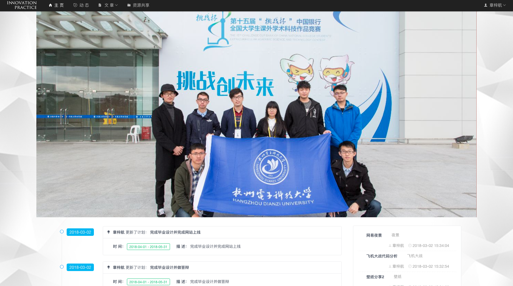
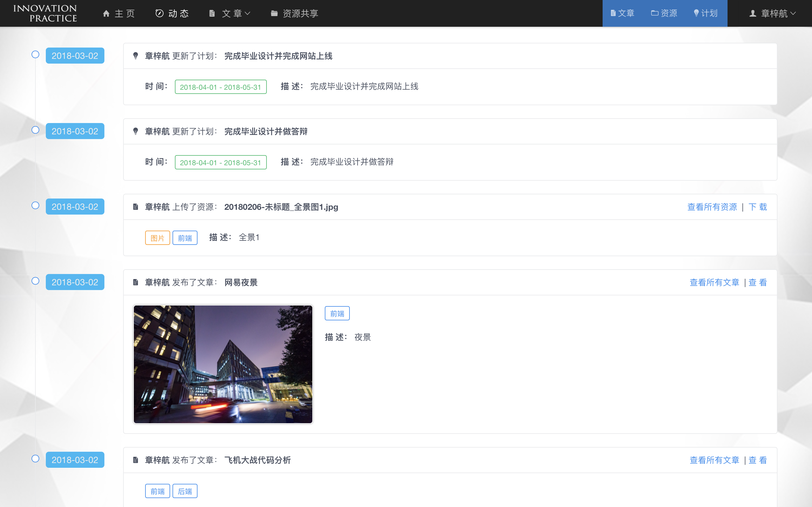
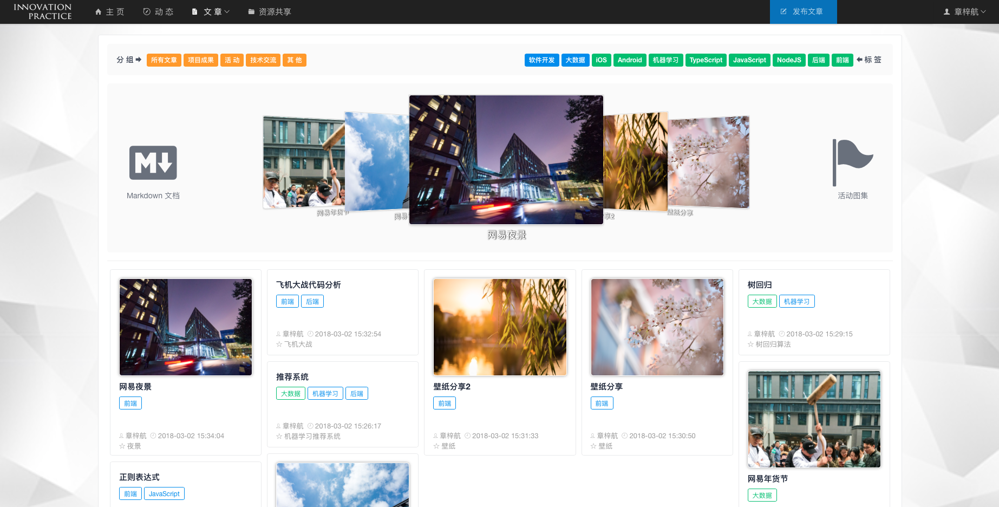
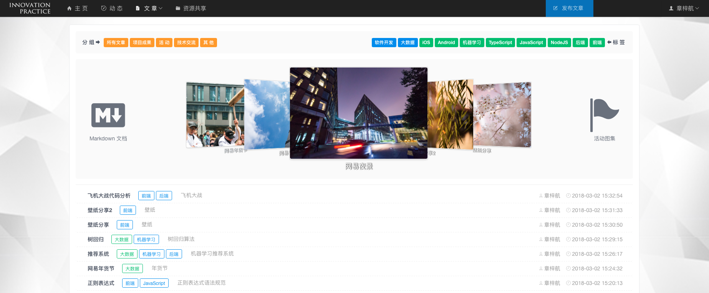
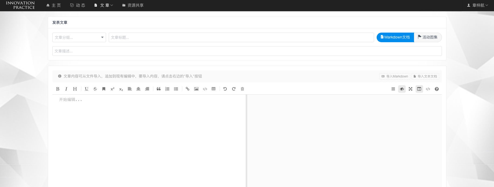
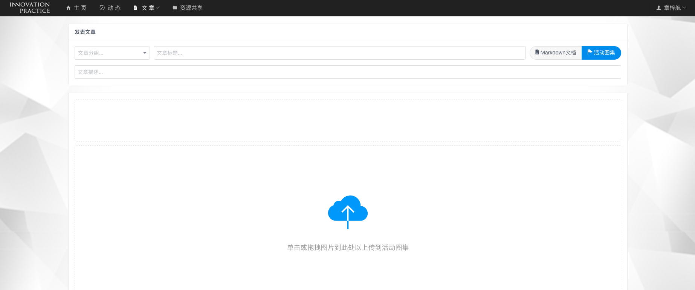
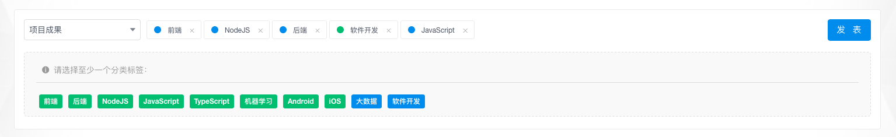
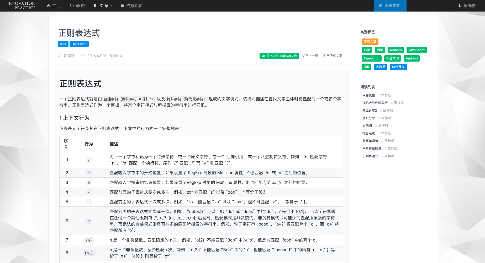
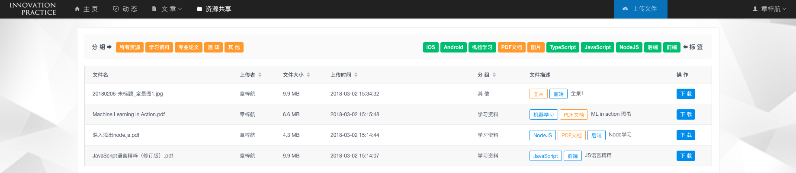
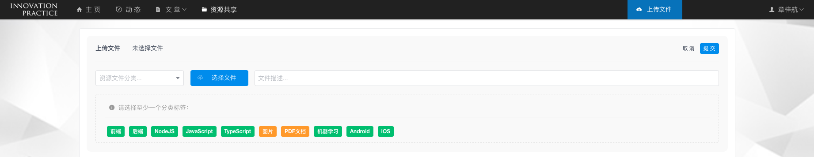

# Innovation-Platform: 通用功能说明书

**《创新实践》课程交流互动平台**，是为杭州电子科技大学计算机学院《创新实践》课程定制的Web应用，为课程提供一个高效的测评工具与信息共享展示平台。

> [**进入介绍页面**](./innovation-platform.md)  
> 本说明适用于平台的所有用户。

### 1 首 页 - 轮播动态

首页由轮播图、动态信息和文章列表三部分组成。以轮播图为主，反映了课程新的动向和风采。

* 首页轮播图由教师管理。

### 2 动 态 - 日常活动

动态页面展示三种类型的动态：发表文章、上传文件、制定计划。它显示了课程中活跃的氛围。

* 考虑到时效和性能，动态只显示前40条。

* 在右上角导航按钮中可细分动态类型。

### 3 文 章 - 课程交流

文章是课程交流和对外展示的重要窗口。教师或学生发表文章，促进课程交流和班级建设。

* 文章根据组别与内容标签分类，并引入列表与瀑布流两种布局模式，分别对应`Markdown 文档`和`活动图集`。

* 点击相应组别、标签，或 `Markdown 文档`、`活动图集` 按钮，可查看相应布局模式与内容。

登录用户可发布文章。点击右上角发布文章按钮，选择相应模式即可发表。

注意事项：

* 文章编辑有两种模式：Markdown编辑与活动图集编辑。选择相应模式编辑完成后，检查完善组别、标题、描述与标签等信息后，方可发表。

* Markdown编辑器支持**文档导入**（仅Chrome）和**本地图片上传**。

* 文章内容一旦发布无法更改，请认真检查。

文章详情页面分为内容、阅读列表和评论区三部分。可点击标签寻找不同类型的文章，直接在当前页面查看。对于Markdown 文档，还可点击按钮导出文件。

### 4 资 源 - 资源分享

资源分享提供与文章一样的标签系统，可以方便寻找和分享资源文件。

点击右上角上传文件按钮，即可完善信息并上传文件。

