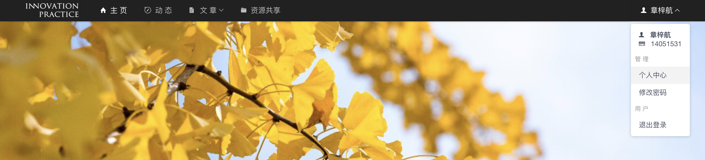
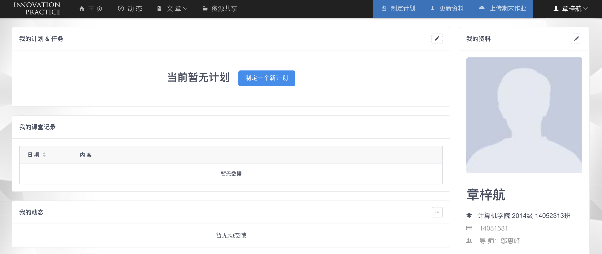
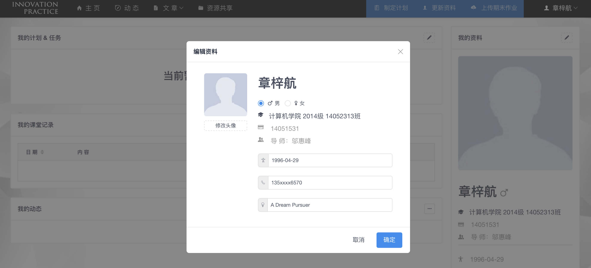
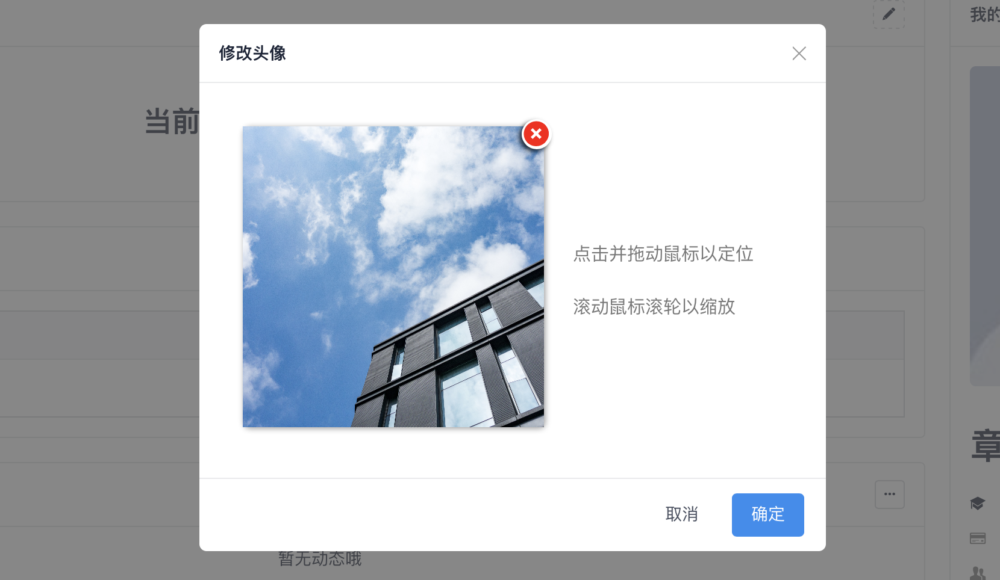
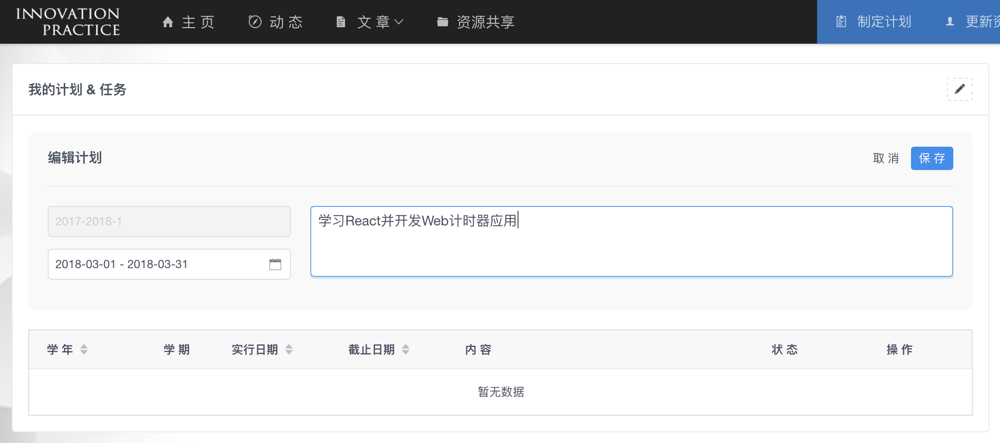
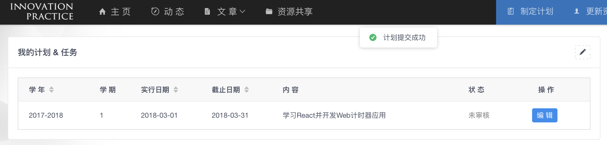
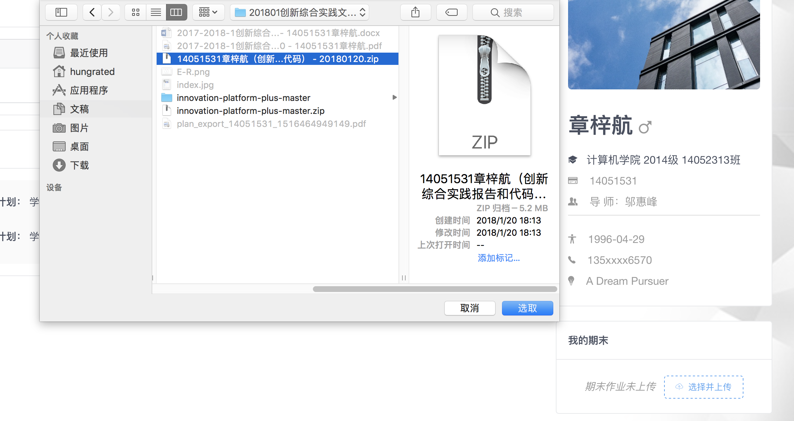
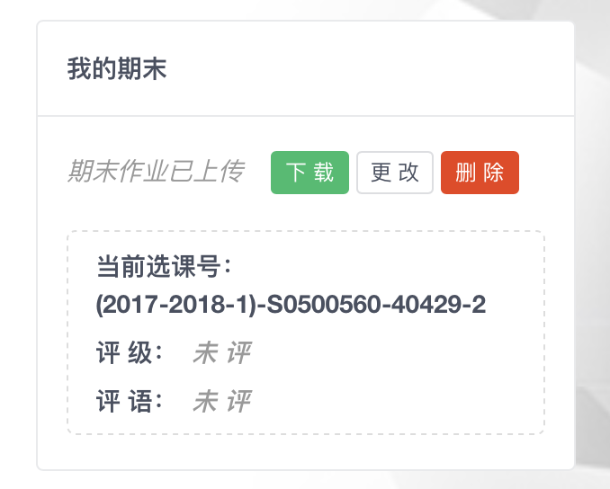

# Innovation-Platform: 学生指南

创新实践》课程交流互动平台，是为杭州电子科技大学计算机学院《创新实践》课程定制的Web应用，为课程提供一个高效的测评工具与信息共享展示平台。

> [**进入介绍页面**](./innovation-platform.md)  
> 本说明适用于平台的 `学生用户`。

### 学生个人中心

学生个人中心是学生在课程中提交计划、上传期末作业的窗口，提供了一系列实用功能。

注意事项：

* 登入平台的默认用户名和密码均为学生学号。首次登入平台后，请记得修改密码以增强安全性。

* 登入平台，点击右上角姓名或下拉菜单的个人中心按钮即可进入个人中心页面。

学生个人中心有如下信息：

* 个人档案：学生个人基本信息，仅自己与任课教师可见，用于导出计划表和成绩表

* 我的计划与任务：学生该学期课程内所列计划

* 我的课堂记录：学生上课期间由教师根据课堂情况所做的记录，学生无法修改

* 我的动态：学生发表文章、上传文件、制定计划所产生的动态信息

* 我的期末：学生的期末作业、评级等情况

* 我的文章：学生最新发表的文章列表

#### 1 更新档案

点击我的资料模块右上角即可修改个人资料与头像。

点击确定按钮，即可保存修改的信息。

#### 2 提交与修改计划

点击导航栏或计划任务模块相应按钮即可编辑计划，点击右上角保存按钮提交计划。

点击编辑按钮重新进入编辑界面，可重复修改保存直至通过任课教师的审核。

注意事项：

* 计划有四个状态：**未审核**、**已修改**、**已通过**、**未通过**。

* 当计划被审核通过，学生**无法再修改**，应该按照计划完成学习或开发任务

* 若计划未通过审核，则**必须修改并再次提交**

* 计划处于已修改状态时，表示**已有一个修改过的新的计划替换了原计划**。

#### 3 上传期末作业

创新实践课程的期末作业是教师评分的最重要依据。平台提供了期末作业交互功能。

点击导航栏的上传期末作业按钮，或我的期末模块相关按钮，即可上传期末作业并等待教师评分。

注意事项：

* 期末作业未评期间，学生可以下载、更改或删除期末作业文件。若已出期末总评，则评分会出现在个人中心的相应位置。
