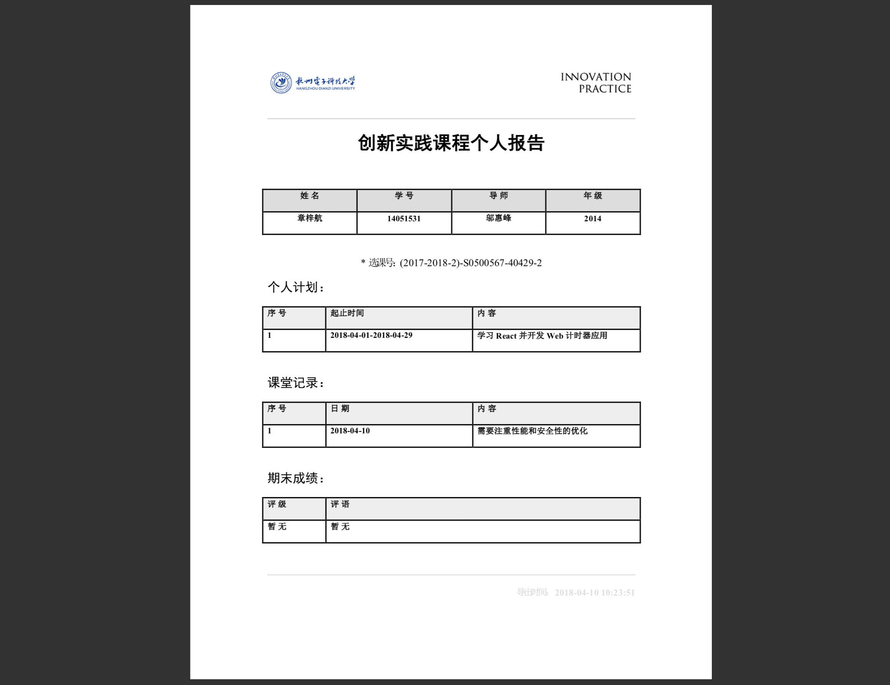

# Innovation-Platform: 教师指南

创新实践》课程交流互动平台，是为杭州电子科技大学计算机学院《创新实践》课程定制的Web应用，为课程提供一个高效的测评工具与信息共享展示平台。

> [**进入介绍页面**](./innovation-platform.md)  
> 本说明适用于平台的 `教师用户`。

### 1 主览面板

#### 1.1 导入班级与学生信息

由于课程设置原因，我们不希望有多余的学生注册进平台。所以采用点名册信息导入机制，关闭自主注册通道。教师若需要注册账号，请联系管理员。

操作步骤如下：

(a) 点击导入按钮；

(b) 选择需要导入的班级点名册（该Excel表格从数字杭电教务系统下载）；

(c) 选择文件并点击右上方提交按钮后，弹出确认信息并仔细核对；

(d) 点击右下角确定按钮，成功导入学生信息。

注意事项：

* 当操作全部完成后，平台会自动新建**学生账号**、**该生档案**和**该生该课程期末作业记录**，便于后期维护和使用。

* 若是首次导入学生用户，教师需要提醒学生首次尝试登入平台并修改密码，若有问题请及时联系管理员。

* 若已有班级学生账号信息，则仅更新该生档案中的**当前选课号**信息，以及新建**该生该课程期末作业记录**。**同一班级的点名册请勿重复上传**。

* 导入文件格式为 `.xls`，不支持点名册以外的Excel表格导入

#### 1.2 查看并审核学生计划

学生计划动态的最新30条信息会在主览面板显示，教师可直接进行审核操作。

注意事项：

* 计划有四个状态：**未审核**、**已修改**、**已通过**、**未通过**。

* 计划处于未审核状态时，教师可进行审核操作，计划若处于其他状态，教师一般情况下不可再次审核（若遇特殊情况，可在全站信息管理面板重新审核，详见 `3 全站信息管理`）。

* 当计划被审核通过，学生**无法再修改**，应该按照计划完成学习或开发任务

* 若计划未通过审核，则**必须修改并再次提交**

* 计划处于已修改状态时，表示**已有一个修改过的新的计划替换了原计划**。

### 2 班级与学生

班级与学生页面分为左右两栏，左边是教师所带有效（即该学期所带）班级列表，右边是学生详细列表，可直观查看与操作所有学生的相关信息。

右侧列表分为计划与总评模式，对应平常与期末的使用。默认为计划模式。

#### 2.1 查看和导出学生信息

学生列表中包含了学号、姓名、最新计划和最新课堂记录信息。

点击右侧查看与管理按钮，查看学生个人本学期总体情况。在此处也可以审核计划。

点击右上角导出所有信息按钮，生成并下载Word文档查看。

#### 2.2 管理学生信息

(a) 在计划模式，点击表格中的新增按钮，即可新增课堂记录。

(b) 进入总评模式，可查看学生上传的期末作业、编辑评分与评语，或导出期末成绩表。

注意事项：

* 当学生未上传期末作业时，教师无法给出总评成绩。

### 3 全站信息管理

全站信息管理模块给教师提供了自由管理平台展示信息的工具，可以在不同状况下灵活使用。

可管理的信息和能够进行的操作如下：

|序号|信息类型|可进行的操作名称|删除后影响|
|---|---|---|---|
|1|首页轮播图|`新 增` `变更图片` `切换展示状态` `删 除`|无|
|2|文 章|`查看原始内容` `管理标签` `删 除`|删除附带的图片与评论|
|3|图 片|`删 除`|删除图片文件|
|4|评 论|`删 除`|无|
|5|计 划|`更改审核结果`|无法删除|
|6|课堂记录|`查看原始内容` `删 除`|无|
|7|资源文件|`管理标签` `删 除`|删除原文件|
|8|班 级|`切换状态`|无法删除|
|9|标 签|`新 增` `删 除`|无|

注意事项：

* 查询信息时可**附带其他特定条件**，如学号等。

* 涉及文件信息的删除操作，会将服务器上的原文件随记录**一并删除**。

* 首页轮播图或班级从**活跃状态**切换至**存档状态**，相当于**在前台隐藏**，数据仍保存在数据库中。

* 对于标签的删除，其并不影响文章和资源文件标签的查询，故**仅删除标签记录**即可，无需修改相应数据库内容

